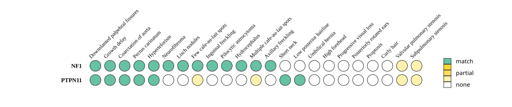

# Overlap plots

The Overlap plot shows a row for each gene identified as harboring a causal genotype. If a gene is associated with more than one disease, the user can choose which disease was diagnosed or can indicate a combination or all diseases if the specific disease diagnosis is unclear. 

One column is shown for each phenotypic abnormality observed (HPO terms). A green dot is shown if the HPO term is also associated with the disease. A yellow dot is show if there is an inexact match. An empty circle is shown if the disease is not annotated to the HPO term in question in the HPO annotation resource. 

<figure>
  
  <figcaption>
    Data from Bertola DR, et al. (2005) <a href="https://pubmed.ncbi.nlm.nih.gov/15948193/">Neurofibromatosis-Noonan syndrome: molecular evidence of the concurrence of both disorders in a patient. <em>Am J Med Genet A</em> <strong>136</strong>:242-5</a>
  </figcaption>
</figure>