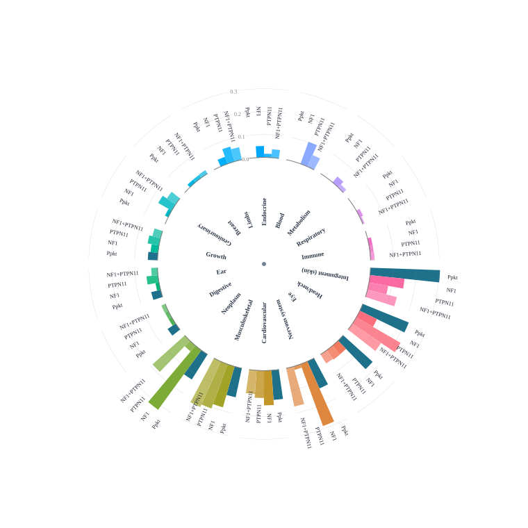

# Phenotype Profile Plot

Phenotype Profile Plots are spread plots that visualize the organ distribution of features in an individual as compared to the distribution of features in the diseases. The organs correspond to the top-level organ terms in the [Human Phenotype Ontology](https://hpo.jax.org/). For instance, **nervous system** corresponds to [Abnormality of the nervous system 
(HP:0000707)](https://hpo.jax.org/browse/term/HP:0000707) and **endocrine** corresponds to [Abnormality of the endocrine system (HP:0000818)](https://hpo.jax.org/browse/term/HP:0000818).

Each organ shows bars that correspond to counts

- **ppkt**: The count of HPO terms in the phenopacket that represent abnormalities in the corresponding organ
- **gene symbol**: The count of HPO terms in the disease model corresponding to the gene symbol that represent abnormalities in the corresponding organ. In the figure shown below, the gene symbols are _NF1_ and _PTPN11_.
- **combination**: The count of HPO terms that are common to both (or all) of the disease models for individual genes. In the figure shown below, the combination is _NF1_+_PTPN11_.

Counts are represented as proportions as a radar plot.

<figure>
  
  <figcaption>
    Data from Bertola DR, et al. (2005) <a href="https://pubmed.ncbi.nlm.nih.gov/15948193/">Neurofibromatosis-Noonan syndrome: molecular evidence of the concurrence of both disorders in a patient. <em>Am J Med Genet A</em> <strong>136</strong>:242-5</a>
  </figcaption>
</figure>